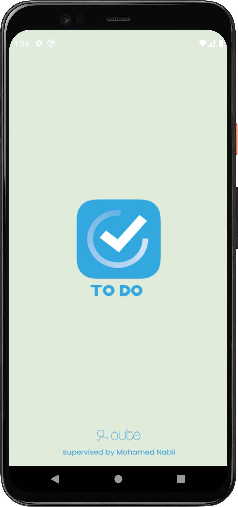
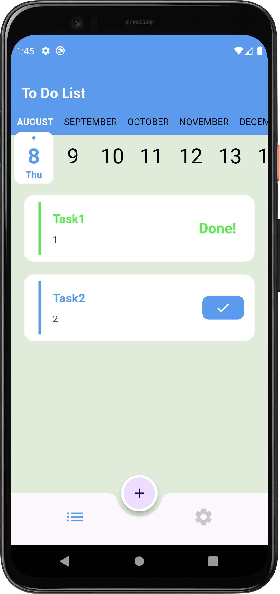
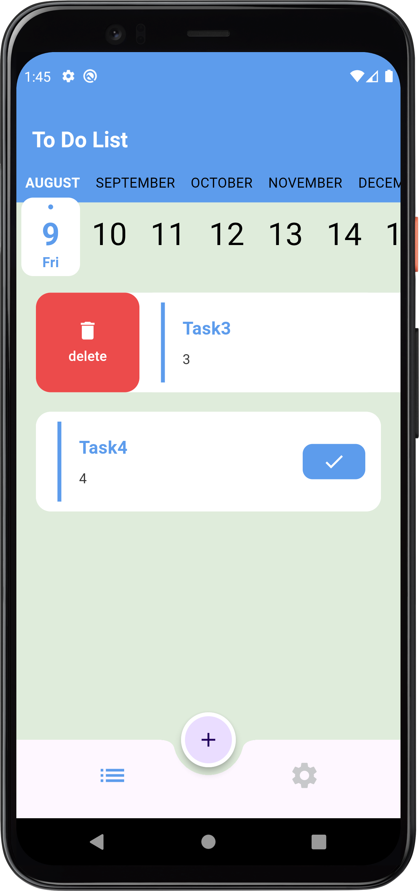
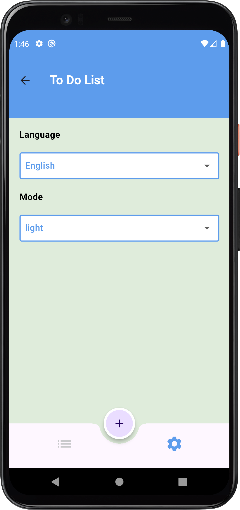

# Todo App

## Description
The Todo Application is a mobile application built using Flutter that allows users to manage their daily tasks. Users can add, delete, and edit tasks, and the application stores the tasks in a Firebase database.

## Features
1. Add Todo: Users can add new tasks to their todo list.
2. Delete Todo: Users can delete tasks from their todo list.
3. Edit Todo: Users can edit the details of an existing task.
4. Firebase Integration: The application uses Firebase to store and retrieve the user's todo list.
5. Provider State Management: The application uses the Provider package for state management.

## Technologies Used
- Flutter
- Dart
- Firebase
- provider (state management)

## Screenshots
     

    

## Contact
If you have any questions or feedback, please feel free to reach out to the project maintainers:
- Ahmed Mohsen : ahmedmohsen2492@gmail.com

